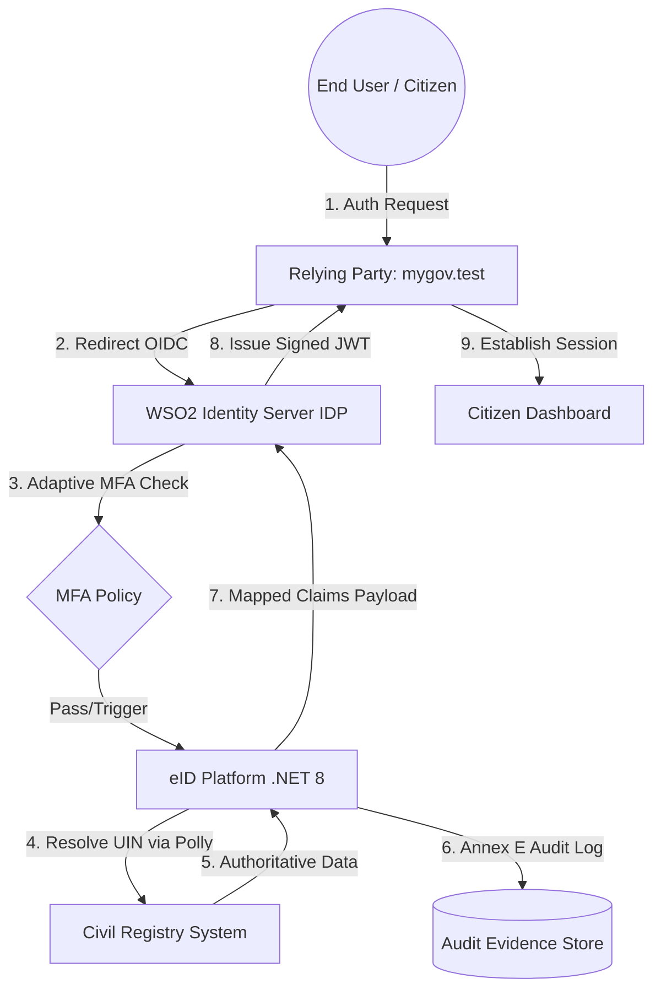

# 🚀 03: Master Production Development Plan & Implementation Roadmap

**System Name:** Government of Sint Maarten eID & WSO2 Ecosystem  
**Target Environment:** Production (Sint Maarten Government Cloud / Kubernetes)  
**Assurance Standard:** EU eIDAS Level High & UN/CEFACT Identity Framework  

---

## 1. Executive Implementation Roadmap

This master development plan coordinates the multi-phase execution of the **WSO2 Identity Server (IDP)**, **ASP.NET Core 8 eID Platform (`eid-backend-dotnet`)**, and **Relying Party (`mygov.test`) Integration**.

```
Phase 1: Environment Setup & Core WSO2 Customization
Phase 2: ASP.NET Core 8 eID Platform Scaffold & Data Contracts
Phase 3: Civil Registry Resolution, Polly Circuit Breaker & Stub Engine
Phase 4: Annex E Cryptographic Evidence & Audit Logger
Phase 5: Relying Party (Laravel mygov.test) Integration & E2E Validation
Phase 6: Production Hardening, Security Audit & Deployment
```

---

## 2. Detailed Phase Breakdown & Action Items

### Phase 1: Environment Setup & Core WSO2 Customization (Week 1 - 2)
* [x] Deploy containerized WSO2 IS 7.x instance (`https://localhost:9443`).
* [x] Configure custom Sint Maarten claim dialects under `http://wso2.org/claims` (`bsn_number`, `uin`, `eid`, `municipality`).
* [x] Implement Adaptive MFA JavaScript Scripting in WSO2 Console for per-RP risk policy enforcement.
* [x] Set up front-channel and back-channel Single Logout (SLO) with `prompt_on_logout = false`.
* [ ] Configure asymmetric **RS256** token signing key rotation policy and JWKS endpoint.

### Phase 2: ASP.NET Core 8 eID Platform Build (`eid-backend-dotnet`) (Week 3 - 4)
* [ ] Scaffold ASP.NET Core 8 Web API solution structure:
  - `SintMaarten.EID.Api`
  - `SintMaarten.EID.Core`
  - `SintMaarten.EID.Infrastructure`
  - `SintMaarten.EID.Services`
* [ ] Implement JWT Bearer token validator checking WSO2 IS JWKS (`/oauth2/jwks`).
* [ ] Build `X-EID-System-Key` middleware for authorized server-to-server microservice lookups.
* [ ] Create configuration-driven per-RP claim transformer engine in `appsettings.json`.

### Phase 3: Civil Registry Resolution & Polly Resilience (Week 5)
* [ ] Build Civil Registry HTTP Client interface (`ICivilRegistryClient`).
* [ ] Implement **Polly Resilience Pipeline**:
  - Exponential backoff retries (3 attempts).
  - Circuit Breaker (break after 50% failure over 10s).
  - Timeout policy (3s hard limit per registry call).
* [ ] Create mock Civil Registry stub engine for sandbox testing.

### Phase 4: Annex E Cryptographic Audit Logger & Tracing (Week 6)
* [ ] Implement `X-Correlation-ID` middleware to propagate correlation IDs across WSO2 ➔ eID ➔ Registry.
* [ ] Build `AnnexEEvidenceLogger` service generating immutable SHA-256 digital digests of transactions.
* [ ] Enforce zero plaintext PII log masking policy across all log output formats.

### Phase 5: Relying Party (`mygov.test`) Integration & Testing (Week 7)
* [ ] Update `Wso2Controller.php` in `mygov.test` to handle OIDC brokering callback & token exchange.
* [ ] Store enriched Sint Maarten citizen profile (`user_profile`) in Laravel session.
* [ ] Build Sint Maarten eID registration wizard with passport photo and ID document uploads.
* [ ] Implement 2FA TOTP Google Authenticator challenge screens.

### Phase 6: Production Hardening & Security Compliance (Week 8)
* [ ] Perform penetration testing and OWASP Top 10 security audit.
* [ ] Verify TLS 1.3 encryption and cipher suite hardening.
* [ ] Perform load testing (target: 1,000 peak requests/sec with p95 < 300ms).
* [ ] Deploy to Sint Maarten Government High-Availability Kubernetes Cluster.

---

## 3. Component Architecture & Responsibility Matrix



---

## 4. Deliverables Checklist

- [x] `requirements-doc/01_wso2_setup_and_customization_requirements.md`
- [x] `requirements-doc/02_eid_dotnet_development_and_integration_requirements.md`
- [x] `requirements-doc/03_master_production_development_plan.md`
- [x] WSO2 IS & Keycloak SSO Brokering Docker Environment
- [x] Sint Maarten eID Frontend Wizard with Document Uploads
- [x] Go Prototype API with TOTP 2FA, Magic Link, and Passkeys
