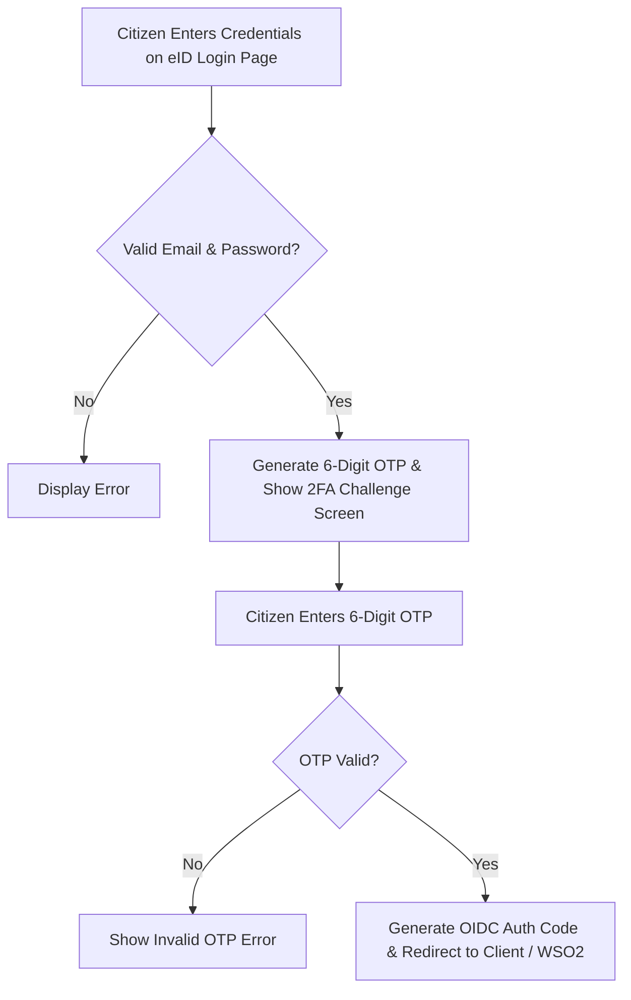

# Multi-Factor Authentication (MFA / 2FA) Implementation Plan (`MFA_2FA_IMPLEMENTATION_PLAN.md`)

> [!IMPORTANT]
> **Presentation Target:** Enable working 2FA (SMS/Email OTP & TOTP Authenticator) on the eID login page (`/oauth/authorize`) so it can be demonstrated live during tomorrow's client presentation.

---

## 1. Feature Specifications & User Experience

### 1.1 OIDC Login Flow with 2FA Challenge (`/oauth/authorize`)
1. **Step 1 (Credential Verification):** Citizen enters Email/EID and Password on the eID login screen.
2. **Step 2 (2FA Trigger):** Upon credential validation, the Go backend generates a 6-digit OTP code (e.g. valid for 5 minutes) and returns `mfa_required: true`.
3. **Step 3 (2FA UI Challenge):** The eID Next.js frontend transitions smoothly to the **"2FA Verification Required"** screen asking for the 6-digit OTP code (with a demo helper badge displaying the code for presentation testing).
4. **Step 4 (Final Redirection):** Citizen submits the 6-digit OTP code. Upon successful verification, the authorization code is issued and the user is redirected back to WSO2 / `mygov.test`.

### 1.2 TOTP Authenticator Setup (Google Authenticator)
1. Add a **"Security & 2FA"** tab in the eID Citizen Dashboard (`eid-frontend`).
2. Display a QR code (using `otpauth://totp/eID:user@email.com?secret=...&issuer=eID-Platform`) for citizens to scan with Google / Microsoft Authenticator app.

---

## 2. API Endpoints Breakdown (`eid-backend-go`)

### 2.1 OTP Services
* `POST /api/v1/mfa/send-otp`  
  * **Payload:** `{ "email": "tarikul@mygov.test" }`  
  * **Response:** `{ "status": "sent", "message": "OTP sent successfully", "demo_otp": "123456" }`
* `POST /api/v1/mfa/verify-otp`  
  * **Payload:** `{ "email": "tarikul@mygov.test", "otp": "123456" }`  
  * **Response:** `{ "verified": true }`

### 2.2 TOTP Authenticator Services
* `POST /api/v1/mfa/totp/setup`  
  * **Response:** `{ "secret": "JBSWY3DPEHPK3PXP", "qr_code_url": "..." }`
* `POST /api/v1/mfa/totp/verify`  
  * **Payload:** `{ "code": "654321" }`  
  * **Response:** `{ "verified": true }`

---

## 3. Master Actionable Checklist

### Phase 1: Go Backend MFA Package (`eid-backend-go`)
- [ ] Create `internal/mfa` package in Go backend.
- [ ] Implement OTP generator & in-memory/cache store with 5-minute expiration.
- [ ] Add `POST /api/v1/mfa/send-otp` & `POST /api/v1/mfa/verify-otp` endpoints.
- [ ] Update `AuthorizeSubmitHandler` to support `step: "credentials"` vs `step: "mfa"`.

### Phase 2: Next.js Frontend 2FA Screen (`eid-frontend`)
- [ ] Update `/oauth/authorize/page.tsx` with a multi-step form state (`CREDENTIALS` ➔ `MFA_CHALLENGE`).
- [ ] Build 6-digit OTP input card UI with countdown timer and Resend button.
- [ ] Add presentation demo helper badge showing OTP code for live testing.

### Phase 3: Verification & End-to-End Test
- [ ] Test login via `mygov.test` ➔ WSO2 ➔ eID ➔ 2FA OTP Challenge ➔ Redirect to Dashboard.
- [ ] Update walkthrough artifact for tomorrow's presentation.
